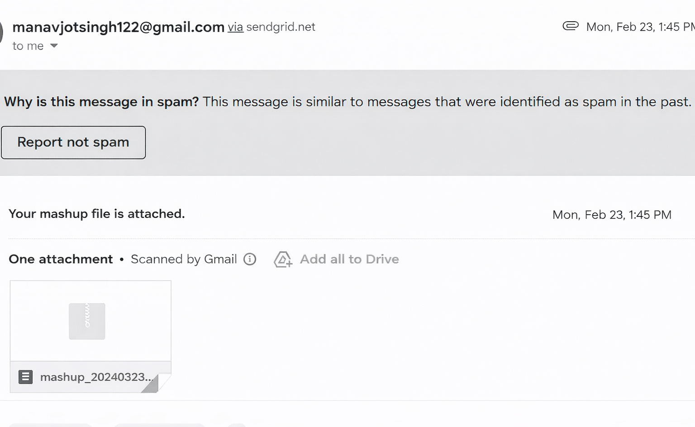

# Assignment- YouTube Mashup Automation Pipeline

Submitted by - Yatin Arora [102303935]

An automated media processing application developed using Python and Streamlit that generates custom audio mashups from YouTube search results.

The system allows users to enter a topic, automatically retrieves relevant videos, extracts selected audio segments, merges them into a single mashup track, and produces a compressed output file — all through a simple and user-friendly web interface.

# Overview

The pipeline executes the following steps:

1) Searches for YouTube videos based on a user-defined keyword
2) Downloads the selected videos using yt-dlp
3) Converts the downloaded video files into audio format
4) Extracts the first 30 seconds from each audio track
5) Combines all extracted segments into a single mashup file
6) Compresses the final mashup into a ZIP archive
7) Generates a downloadable output with optional email delivery

The application is designed using a modular architecture, ensuring improved maintainability, scalability, and ease of future enhancements.


# Application Workflow

1) The user inputs a search keyword.
2) The user selects the number of videos to be processed.
3) The system retrieves and downloads relevant YouTube videos.
4) Each downloaded video is converted into an audio file.
5) The first 30 seconds of every audio track are extracted.
6) All extracted segments are sequentially combined into a single mashup.
7) The final mashup is compressed into a ZIP archive.
8) The user downloads the generated output file.


# Output 
<p align="center">
  
</p>

## Project Structure

```
youtube_mashup_pipeline/
│
├── app.py
├── requirements.txt
├── README.md
│
├── config/
│   └── settings.py
│
├── pipeline/
│   ├── downloader.py
│   ├── audio_converter.py
│   ├── cutter.py
│   ├── merger.py
│   ├── zipper.py
│   └── mailer.py
│
├── utils/
│   └── helpers.py
│
├── data/
│   ├── videos/
│   ├── audios/
│   ├── clips/
│   ├── output/
│   └── zip/
│
└── images/
    └── youtube_email.png
```
# Architectural Design

1) The project is structured using a layered, modular pipeline architecture with a clear separation of concerns:
2) downloader.py manages YouTube search and video downloads using yt-dlp
3) audio_converter.py converts video files into audio format using MoviePy
4) cutter.py extracts fixed-duration audio segments with Pydub
5) merger.py merges multiple audio clips into a single mashup track
6) zipper.py handles compression of the final mashup file
7) mailer.py enables optional email delivery of the output
8) helpers.py manages directory creation and cleanup operations

The Streamlit user interface is intentionally separated from the core processing modules, ensuring adherence to clean architecture principles, improved maintainability, and easier scalability.


# Key Features

User-defined selection of the number of videos to process.
End-to-end automated processing workflow.
Modular and easily maintainable architecture.
Automated directory creation and cleanup.
Automatic ZIP archive generation.
Optional email delivery integration.
